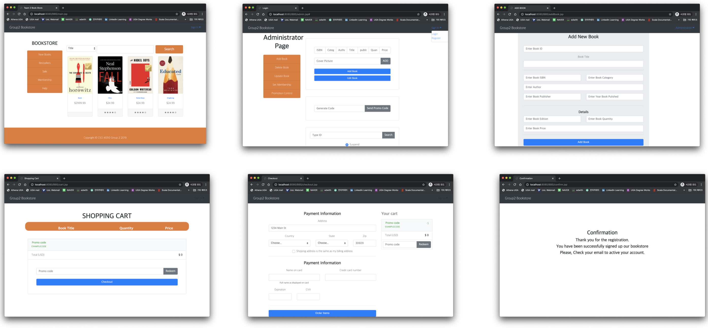
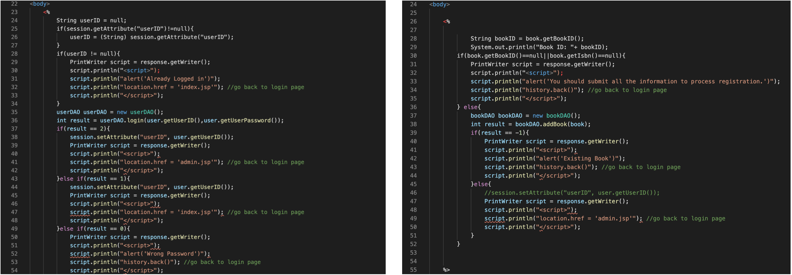
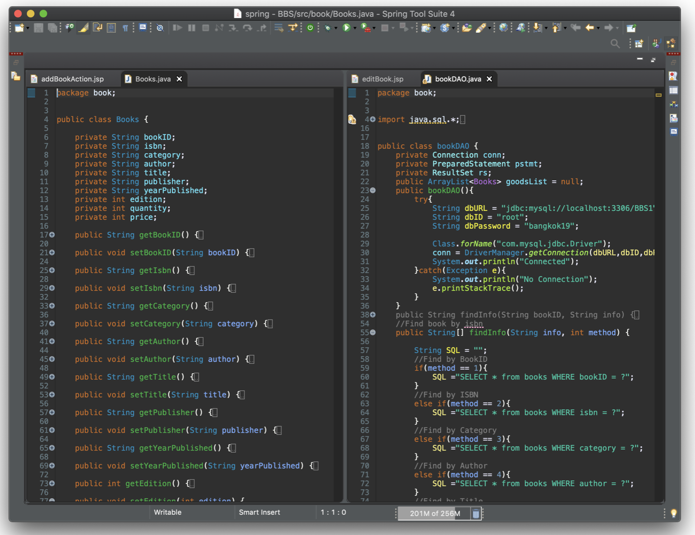

# Online Bookstore

👨‍🔧 Chanjo Moon

📧 cm79252@uga.edu

# Project Description

• A responsive webpage that displays details of books in the store. 
Website provides options such as browsing books based on categories or authors, 
searching the required book, viewing full description page of any book. 
User can register and login on subsequent accesses, view his/her cart, buy books that in the cart. 
Admin can send the promotion to their registered customers.

• Java Developer / Web designer

• Designed DAO architecture / Administrator, Login, Shopping Cart, Checkout, and Main page

# Using Technology
• Java, JSP, MySql, Bootstrap, Spring Framework

# MVC Architecture

Sample page for Webpage (View)

View displays data using model to the user and also enables them to modify the data. 
There are 3 levels of hierarchy for the user, administrator, registered user, and unregistered user, 
to show different interfaces depend on their own authority.

Sample code for Action Page (Control)

Controller handles the user request. By using action page, the newly updated data is sent to the database (sql) simultaneously. 
Typically, user interact with View, which in-turn raises appropriate URL request, this request will be handled by a controller. 
The controller renders the appropriate view with the model data as a response.

Sample code for DAO (Model)

In this architecture, Model represents shape of the data and data action object (DAO). 
It maintains the data of the application. Model objects retrieve and store model state in a database.
